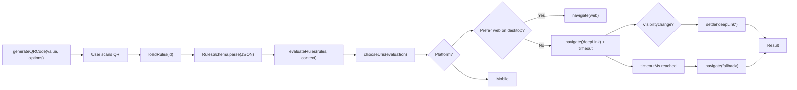

# @smartqr/core

Core package of **Smart QR**.
Provides **rule validation**, **rule evaluation**, **action resolution** (deep link/web/fallback), and **QR code generation** in SVG format.
Designed to be framework-agnostic, lightweight, and ready for integration with React/Vue bindings.

---

## 📦 Installation

```bash
pnpm add @smartqr/core
```

---

## 🚀 Features

- **Rules validation** with [zod](https://github.com/colinhacks/zod).
- **Conditional evaluation** by OS, language, date range, rollout percentage.
- **Action resolution** with deep link / fallback logic.
- **SVG QR code generation** with customizable colors, size, and transparency.
- **Fully tested** with Vitest (unit tests + snapshot tests).
- **Minimal dependencies** for portability.

---

## 🗂 Package Structure

```
src/
  rules.ts        # Zod schema for rules validation
  evaluate.ts     # Pure function to check if rules match a context
  resolve.ts      # Orchestrates evaluation and executes actions
  generator.ts    # Generates QR codes in SVG format
  index.ts        # Public API
tests/
  resolve.test.ts
  generator.test.ts
  __snapshots__/  # Snapshot for QR SVG
```

---

## 🧩 API

### RulesSchema

```ts
import { RulesSchema } from '@smartqr/core';

const rules = RulesSchema.parse({
  os: ['iOS', 'Android'],
  lang: ['es', 'en'],
  dateRange: { from: new Date('2025-01-01'), to: new Date('2025-12-31') },
  rollout: 50,
  default: { url: 'https://fallback.example.com' }
});
```

**Fields:**
- `os?: string[]`
- `lang?: string[]`
- `dateRange?: { from: Date; to: Date }`
- `rollout?: number` (0–100)
- `default: { url: string }` *(required)*

---

### evaluateRules(rules, context)

```ts
import { evaluateRules } from '@smartqr/core';

const result = evaluateRules(rules, {
  os: 'iOS',
  lang: 'es',
  now: new Date(),
  rolloutRandom: 42 // optional, for deterministic tests
});
```

Returns: `true | false`.

---

### resolveAndExecute(rules, context, options)

```ts
import { resolveAndExecute } from '@smartqr/core';

await resolveAndExecute(rules, {
  os: 'iOS',
  lang: 'es',
  now: new Date(),
}, {
  preferWebOnDesktop: true,
  timeoutMs: 1500,
  onBefore: (action) => console.log('About to execute', action),
  onAfter: (action) => console.log('Executed', action)
});
```

On **mobile**:
- Tries deep link → if not opened within `timeoutMs` → opens fallback.

On **desktop**:
- If `preferWebOnDesktop = true` → opens web directly.

---

### generateQRCode(value, options)

```ts
import { generateQRCode } from '@smartqr/core';

const svg = await generateQRCode('https://example.com', {
  size: 300,
  margin: 2,
  darkColor: '#000000',
  lightColor: '#FFFFFF',
  transparentLight: false
});
```

**Options:**
- `size` (16–4096, default `256`)
- `margin` (default `4`)
- `level` (`L`, `M`, `Q`, `H`, default `M`)
- `darkColor` (default `#000000`)
- `lightColor` (default `#FFFFFF`)
- `transparentLight` (default `false`)
- `version` (1–40, optional)

---

## 🧪 Running Tests

```bash
pnpm -C packages/core test
```

Includes:
- Unit tests for `evaluateRules` and `resolveAndExecute`.
- Snapshot test for `generateQRCode` to detect visual changes in SVG.

---

## 🔄 Flow Diagram



---

## 📝 Contributing

Contributions are welcome!
See [CONTRIBUTING.md](../../CONTRIBUTING.md) for setup instructions, commit conventions, and PR workflow.

---

## 📄 License

[MIT](../../LICENSE) © 2025 Ángel Méndez
